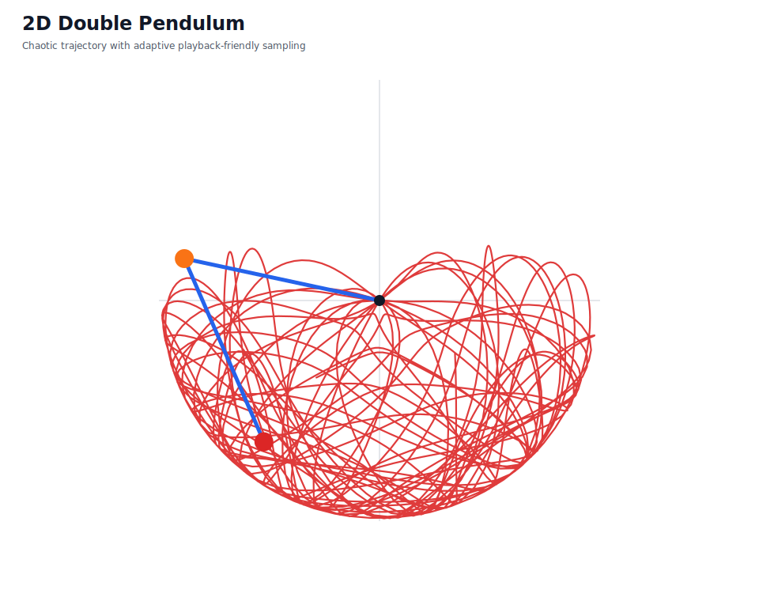
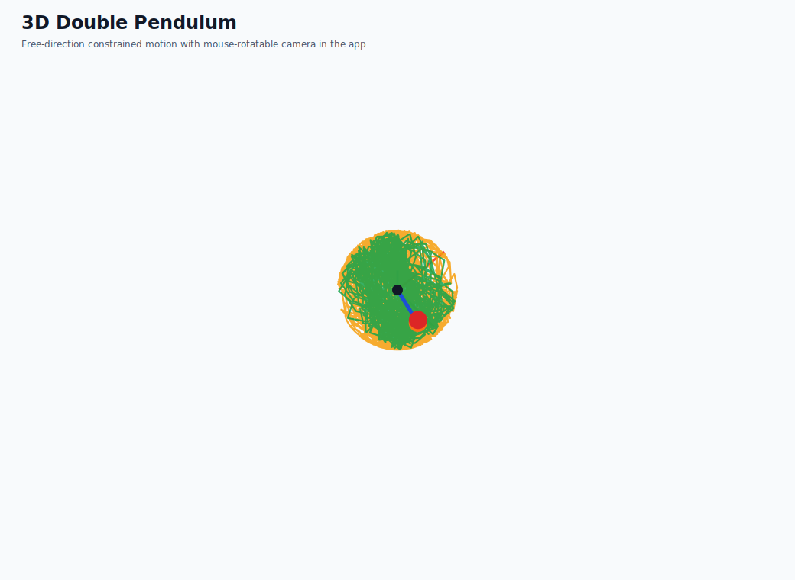
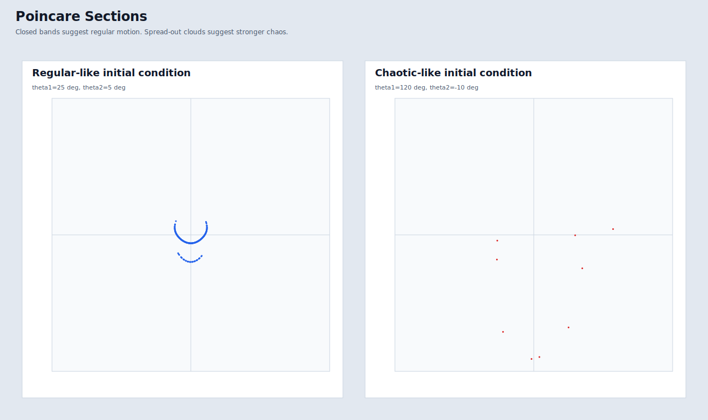
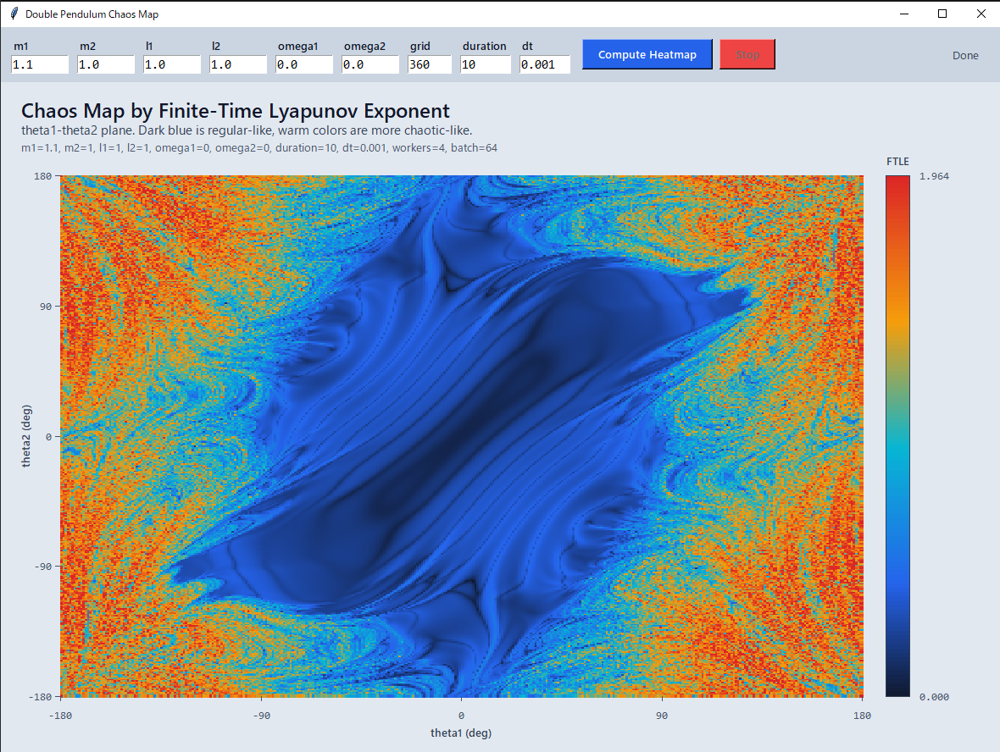

# Double Pendulum Playground

日本語で読める解説ページです。  
This page is a Japanese-first guide with short English notes.

## ギャラリー / Gallery

### 2D 二重振り子



- 日本語: 2D 版は、二重振り子の軌跡を残しながら、長時間でも再生しやすいように描画を軽量化したビジュアライザです。
- English: The 2D viewer keeps a visible trajectory while using lightweight playback logic so long runs stay responsive.

### 3D 二重振り子



- 日本語: 3D 版は、各接点が空間内で自由に向きを変えられる拘束付きモデルで、マウスドラッグで視点回転、ホイールでズームできます。
- English: The 3D viewer uses a constrained free-direction model with drag-to-rotate and wheel-to-zoom camera control.

### ポアンカレ断面 / Poincare Section



- 日本語: 左は比較的正則な条件、右はよりカオス的な条件です。閉じた帯のように見えると正則寄り、広く散るとカオス寄りと考えられます。
- English: Closed bands tend to look more regular, while broader scattered clouds suggest stronger chaos.

### カオスヒートマップ / Chaos Heatmap



- 日本語: この画像は、`theta1-theta2` 平面に対して有限時間リアプノフ指数を塗ったものです。青系は比較的安定、暖色系は初期値鋭敏性が強い領域を示します。
- English: This map colors the `theta1-theta2` plane by finite-time Lyapunov exponent. Cool colors are more regular-like, warm colors are more chaotic-like.

## 収録スクリプト / Included Scripts

| Script | 日本語 | English |
| --- | --- | --- |
| `double_pendulum.py` | 2D 二重振り子のアニメーション。軌跡を残し、可変描画間引きで再生を軽くしています。 | 2D animation with persistent trace and adaptive rendering. |
| `double_pendulum_3d.py` | 3D 空間での拘束付き二重振り子。視点回転とズームに対応しています。 | 3D constrained pendulum viewer with rotation and zoom. |
| `double_pendulum_poincare.py` | ポアンカレ断面を GUI で比較し、正則寄りとカオス寄りの違いを見ます。 | GUI viewer for comparing regular-like and chaotic-like Poincare sections. |
| `double_pendulum_chaos_map.py` | FTLE を使ってカオス度のヒートマップを描きます。途中停止や再計算にも対応しています。 | FTLE-based chaos heatmap with stop and recompute controls. |

## 実行方法 / How To Run

```powershell
python double_pendulum.py
python double_pendulum_3d.py
python double_pendulum_poincare.py
python double_pendulum_chaos_map.py
```

NumPy がまだなら:

```powershell
python -m pip install numpy
```

## それぞれの見どころ / What To Look For

### 2D

- 日本語: 軌跡が一様に埋まるわけではなく、長く滞在する領域が濃く見えます。
- English: The trace does not fill space uniformly. Regions with longer dwell time appear denser.

### 3D

- 日本語: 視点を変えると、同じ運動でも印象が大きく変わります。空間的な拘束運動として眺めると面白いです。
- English: Rotating the camera changes the feel of the motion dramatically, which makes the constrained 3D motion easier to appreciate.

### Poincare Section

- 日本語: 閉曲線っぽい集合は正則寄り、面状に広がる分布はカオス寄りです。
- English: Closed curves look more regular, while area-filling clouds look more chaotic.

### Chaos Heatmap

- 日本語: FTLE は有限時間の指標なので、`duration` や `dt` を変えると見え方も変わります。
- English: FTLE is a finite-time indicator, so the map changes with `duration` and `dt`.

## 補足 / Notes

- 日本語: カオスヒートマップは GPU ではなく CPU ベクトル化とマルチプロセスを中心に最適化しています。
- English: The chaos heatmap is optimized primarily with CPU vectorization and multiprocessing rather than GPU acceleration.

- 日本語: 3D 版は剛体シミュレータではなく、棒長制約を保ちながら動く可視化モデルです。
- English: The 3D version is a constrained visualization model, not a full rigid-body simulator.
